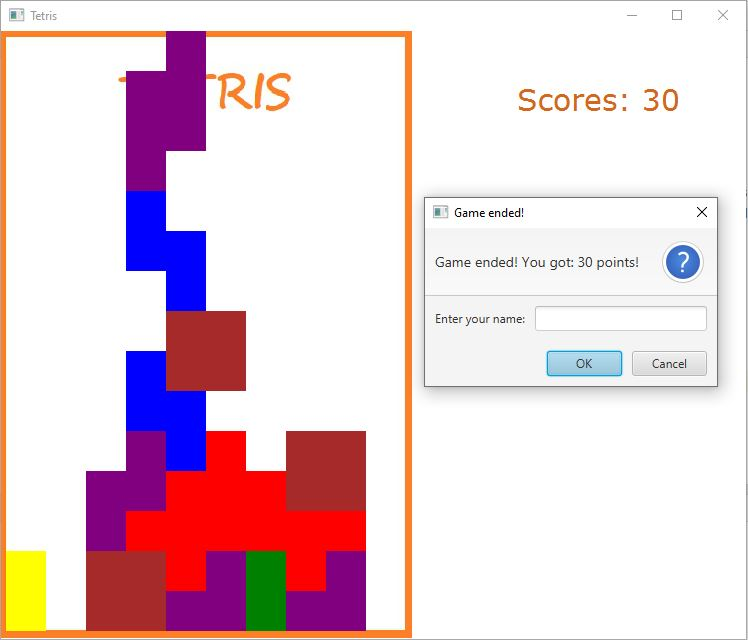

# Tetris Game Project

## Goal of the project: 
The main goal of the project was to practice Java language and related technologies i.e Java FX, OOP. Application allows to play a classic game.

## Technologies:
Java 11, Java FX

## Project screenshot:

## Author:
Tomasz Piątek